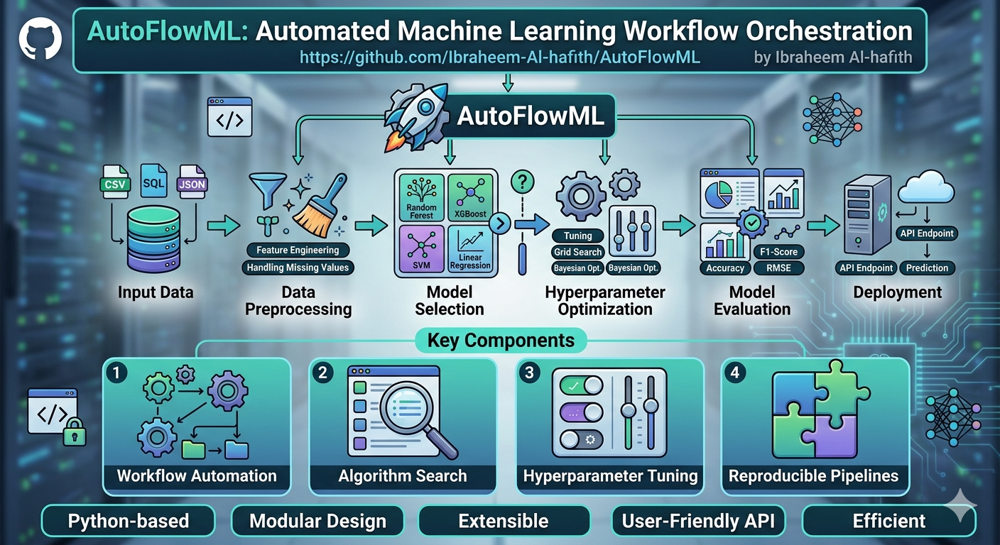

https://github.com/user-attachments/assets/ae81cc30-3810-4475-a454-1f0e7210772c

---

# 🌊 AutoFlowML: Enterprise-Grade AutoML Pipeline Engine

**AutoFlowML** is a high-performance, modular AutoML framework designed to transform raw, messy datasets into production-ready Scikit-Learn pipelines. Built with a focus on **reproducibility**, **transparency**, and **interoperability**, it automates the heavy lifting of data science while giving the architect full control via a centralized configuration system.

<div align="center">

</div>

[](https://github.com/Ibraheem-Al-hafith/AutoFlowML/actions/workflows/test.yml)

---

## 📍 Table of Contents

* [🚀 Featured Properties](#-featured-properties)
* [🏗️ System Architecture](#️-system-architecture)
* [🧰 Tech Stack & Tools](#-tech-stack--tools)
* [📥 Installation & Usage](#-installation--usage)
* [⚙️ Configuration](#️-configuration-configyaml)
* [👨‍💻 Key Design Patterns](#-key-design-patterns-implemented)
* [🧠 Technical Deep Dive](#-technical-deep-dive-proxy-pattern--target-mapping)
* [💡 Why AutoFlowML?](#-why-you-may-be-interested-on-this-framework)
* [🧐 Quality Assurance & Testing](#-quality-assurance--testing)

---

## 🚀 Featured Properties

* **Decoupled Architecture**: Logic is separated into 5 distinct layers (Ingestion, Cleaning, Processing, Engine, Evaluation), making it highly maintainable and unit-testable.
* **Target-Aware Wrapper**: Implements a custom `TargetEncodedModelWrapper` with a **Transparent Proxy**. It handles string-to-numeric encoding for classification internally while exposing underlying model attributes like `feature_importances_`.
* **Dynamic Feature Selection**: Uses `make_column_selector` to ensure the pipeline survives aggressive data cleaning steps (like NaN dropping or cardinality stripping) without breaking column indices.
* **Professional Validation**: Features a **Stratified K-Fold** strategy for both classification and regression (via target binning), ensuring honest, unbiased Out-of-Fold (OOF) performance metrics.

---

## 🏗️ System Architecture

### 1. Data Cleaning & Guardrails

* **Cardinality Stripper**: Automatically detects and drops high-cardinality noise (like IDs or UUIDs) based on a configurable uniqueness threshold.
* **Variance Filter**: Eliminates "Zero-Variance" columns that provide no predictive power.
* **Universal Dropper**: Smart NaN handling that treats numeric and categorical features with distinct, customizable thresholds.

### 2. The Engine (The Brain)

* **Task Detector**: Heuristic-based logic that automatically identifies if a problem is **Regression** or **Classification** by analyzing target distribution.
* **Model Registry**: A plug-and-play system to easily swap or add models (RandomForest, XGBoost, LightGBM, etc.) via `config.yaml`.

---

### 🧰 Tech Stack & Tools

| Category | Tools & Technologies |
| --- | --- |
| **Core & Env** |   |
| **Machine Learning** |    |
| **Data Processing** |   |
| **UI & Visuals** |    |
| **Quality Assurance** |  |

---

## 📥 Installation & Usage

1. **Clone the repository**:

```bash
git clone https://github.com/Ibraheem-Al-hafith/AutoFlowML.git
cd AutoFlowML

```

2. **Install dependencies using `uv`**:

```bash
uv sync

```

3. **Launch the Suite**:

```bash
uv run streamlit run app.py

```

---

## 📂 Project Structure

```
AutoFlowML/
├── src/                      # Core source code
│   ├── __init__.py
│   ├── engine.py             # Logic for task detection & model registry
│   ├── cleaning.py           # Data guardrails (Variance, Cardinality, & NaN strippers)
│   ├── pipeline.py           # Architecture logic and Pipeline construction
│   ├── evaluation.py         # Performance & competition (CV & LeaderboardEngine)
│   ├── processing.py         # Transformers processors and feature extraction
│   ├──visualizer.py          # Plotly chart generation
│   └── utils/                # Shared helpers
│       ├── config_loader.py  # yaml configuration loader
│       └── logger.py         # Custom audit log handler
├── tests/
│   ├── test_cleaning.py      # Validates Cleaning pipeline logic
│   ├── test_config_loader.py # Validates loading configurations
│   ├── test_engine.py        # Validates the task detector
│   ├── test_evaluation.py    # Validates the evaluation logic
│   ├── test_full_pipeline.py # Validates end-to-end fit/predict
│   └── test_preprocessing.py # Validates the transformers logic
├── app.py                    # Streamlit entry point
├── config.yaml               # Centralized settings
├── pyproject.toml            # uv/pip dependencies
└── README.md                 # Documentation

```

---

## ⚙️ Configuration (`config.yaml`)

The entire behavior of the engine is controlled here. No code changes are required to adjust the sensitivity of the pipeline.

```yaml
settings:
  random_state: 42
  cv_folds: 5

cleaning:
  cardinality:
    max_unique_share: 0.9
  variance:
    min_threshold: 0.01

evaluation:
  classification: [accuracy, f1, precision, recall]

```

---

## 🧠 Technical Deep Dive: Proxy Pattern & Target Mapping

### The Target Mapping Challenge

In Scikit-Learn, standard `Pipeline` objects are designed to transform features (), but they do not inherently handle target () transformations for classification. Typically, developers are forced to encode their targets manually before fitting, which leads to "leaky" logic where the mapping (e.g., `0: "High Yield"`, `1: "Low Yield"`) lives outside the saved model object.

### The Solution: `TargetEncodedModelWrapper`

To solve this, I engineered a custom wrapper that encapsulates the `LabelEncoder` logic directly into the estimator.

**1. Automated Target Mapping:**
During the `fit()` phase, the wrapper learns the classes from the raw target strings.

* **Internal**: Maps `"Category A"`  `0`.
* **Inference**: During `predict()`, it performs the inverse mapping, ensuring the pipeline outputs human-readable strings, not arbitrary integers.

**2. The Transparent Proxy Implementation:**
To ensure the pipeline remains fully functional with Scikit-Learn utilities, I implemented the **Proxy Pattern** using Python's magic methods.

```python
def __getattr__(self, name):
    """Reach into the underlying model for attributes like feature_importances_"""
    return getattr(self.model_, name)

```

By overriding `__getattr__`, the wrapper acts as a transparent window. If a user or a visualizer asks for `pipeline.feature_importances_`, the wrapper intercepts the call and fetches it from the underlying model (e.g., a RandomForest), even though that attribute isn't explicitly defined in the wrapper itself.

---

## 👨‍💻 Key Design Patterns Implemented

* **Proxy Pattern**: Implemented in the model wrapper for seamless attribute access.
* **Strategy Pattern**: Used in the `LeaderboardEngine` to swap evaluation metrics based on the detected task.
* **Architectural Layering**: Strict separation between UI (Streamlit), Orchestration (Pipeline), and Logic (Cleaning/Processing).

---

### 💡 Why you may be interested on this framework?

This project demonstrates my ability to bridge the gap between **Data Science** and **Software Engineering**. I don't just build models; I build **scalable systems** that ensure data integrity, facilitate model auditing, and provide a clear path to production deployment.

---


The best way to include testing is a two-pronged approach: **Documentation** (in the README) and **Automation** (in the CI/CD pipeline).

When a developer clones your repo, they should be able to run your tests within 60 seconds of setup. This is a hallmark of a professional project.

---


## 🧪 Quality Assurance & Testing

This project follows a Test-Driven Development (TDD) approach. I use `pytest` for unit and integration testing.

### 1.Running Tests
To run the full test suite in a synchronized environment:
```bash
uv run pytest

```

---

### 2. 📂 Structure of the `tests/` Directory

Ensure your test folder mirrors your `src/` folder. This makes it intuitive for new developers to find where to add tests for new features.

```text
tests/
  ├── test_cleaning.py        # Validates Cleaning pipeline logic
  ├── test_config_loader.py   # Validates loading configurations
  ├── test_engine.py          # Validates the task detector
  ├── test_evaluation.py      # Validates the evaluation logic
  ├── test_full_pipeline.py   # Validates end-to-end fit/predict
  └── test_preprocessing.py   # Validates the transformers logic

```

---
